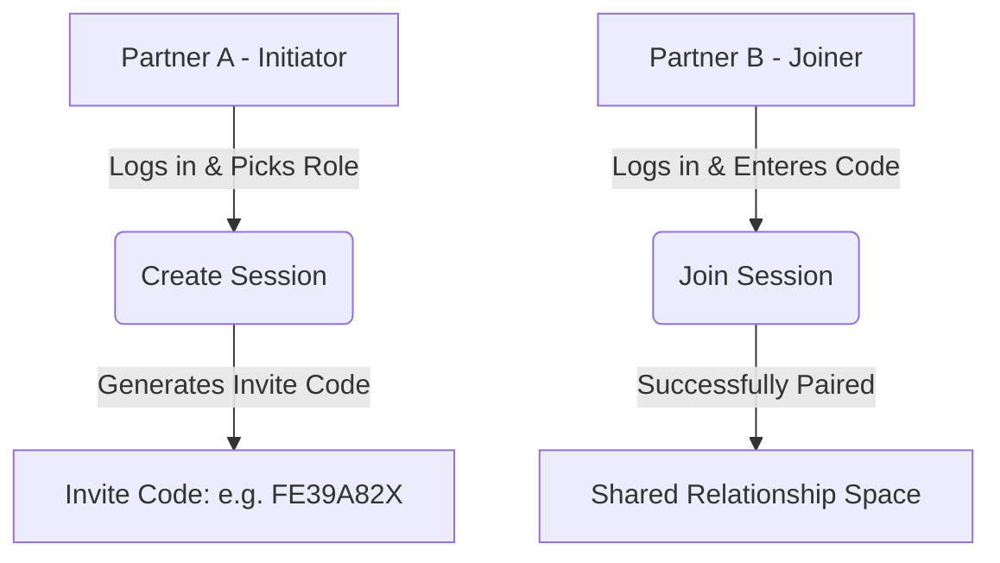

# BondXP — Usage & Deployment Guide

This guide explains how to test, use, and deploy **BondXP** live using Supabase, GitHub, and Vercel.

---

## 🛠️ 1. Local Development & Workflow

### Prerequisites
1. **Node.js**: Ensure Node.js (v18+) is installed.
2. **Supabase Project**: You need an active Supabase project.

### Quick Start
1. Install dependencies:
   ```bash
   npm install
   ```
2. Start the development server:
   ```bash
   npm run dev
   ```
   *Note: Next.js dev scripts run with `--webpack` to support the PWA plugin (`next-pwa` requires webpack compilation).*
3. Open `http://localhost:3000` in your browser.

---

## 👥 2. How the Dual-User (Giver / User) System Works

BondXP uses a **paired role system** mapped via invite codes.



### Roles
1. **Task User (Productivity Partner)**:
   * Logs completed tasks using presets or custom titles.
   * Secures a daily streak by completing 10 tasks before midnight.
   * Earns XP (banked available tasks).
   * Claims streak milestone rewards (Day 1, 3, 5, 7, 10, etc.) on qualification days.
   * Redeems store rewards, creating pending redemptions.
2. **Reward Giver (Affection Partner)**:
   * Reviews the pending redemptions queue to **Approve**, **Schedule**, or **Reject** (which refunds task XP back to the Task User).
   * Gifts bonus tasks (XP) to reward unexpected support or romance.
   * Manages the reward catalog (adds custom items, hides/shows categories).

### Local testing (User & Giver together)
To test both dashboards side-by-side on your local machine:
1. Open one standard browser window (e.g. Chrome) and log in. Pair/choose **Task User**.
2. Open an **Incognito window** or a different browser (e.g. Edge, Firefox) and log in with a different email. Enter the creator's invite code and select **Reward Giver**.
3. Now you can log tasks in Chrome, see the XP grow, request a redemption, and immediately approve/reject it in the Giver screen in Edge!

---

## ⚙️ 3. Managing Rewards (Adding, Reordering, Enable/Disable)

All reward management is controlled by the **Reward Giver** from the **Rewards** page (`/rewards` path):

1. **Adding a Reward**:
   * Click **Add Reward** at the top right.
   * Select a category, add a title, description, cost (in completed tasks), icon (emoji), and cooldown hours.
2. **Enabling / Deactivating**:
   * Click the **Toggle Switch** (toggle right icon) on any reward card.
   * Deactivated rewards display with a dotted border and are disabled in the Task User's store.
3. **Visibility Toggles (Hide / Show)**:
   * Click the **Eye / EyeOff** icon.
   * If hidden, the item is completely invisible in the Task User's store (perfect for planning surprise rewards!).
4. **Custom Reordering**:
   * Use the **Up and Down Arrows** on the right side of the card.
   * Reordering updates the `sort_order` in the database immediately, syncing the store view.
5. **Deleting**:
   * Click the red **Trash Can** icon to permanently delete the reward from the catalog.

---

## 🚀 4. Production Deployment: GitHub & Vercel

Since this repo will be hosted on GitHub, **never commit your `.env.local` file**. The `.gitignore` is already configured to exclude it.

### Step 1: Push Code to GitHub
1. Create a private repository on GitHub (private is recommended since relationship configurations can be intimate).
2. Push your local files to GitHub:
   ```bash
   git remote add origin https://github.com/your-username/bondxp.git
   git branch -M main
   git push -u origin main
   ```

### Step 2: Supabase Schema Deployment
Ensure you've run the SQL scripts in your Supabase SQL editor:
1. Run [schema.sql](file:///c:/Sagar/Projects/AntiGravityProjects/BondXP/supabase/schema.sql) first to set up the tables and RLS security.
2. Run [seed.sql](file:///c:/Sagar/Projects/AntiGravityProjects/BondXP/supabase/seed.sql) to add the initial catalog.

### Step 3: Deploy to Vercel
1. Log into your [Vercel Dashboard](https://vercel.com).
2. Click **Add New** -> **Project**.
3. Import your `BondXP` repository from GitHub.
4. Expand **Environment Variables** and copy the values from your local `.env.local` file:

| Vercel Key | Exact Source Location | Description / Format |
| :--- | :--- | :--- |
| `NEXT_PUBLIC_SUPABASE_URL` | **Supabase Dashboard** -> **Project Settings** -> **API** -> **Project URL** | The URL of your Supabase project (already in your local `.env.local` line 1). |
| `NEXT_PUBLIC_SUPABASE_ANON_KEY` | **Supabase Dashboard** -> **Project Settings** -> **API** -> **Project API Keys** (`anon public`) | The public key for client access (already in your local `.env.local` line 2). |
| `SUPABASE_SERVICE_ROLE_KEY` | **Supabase Dashboard** -> **Project Settings** -> **API** -> **Project API Keys** (`service_role secret`) | Secret administrative bypass key. |
| `NEXT_PUBLIC_VAPID_PUBLIC_KEY` | **Your local `.env.local` file** (Line 6) | Public VAPID key we generated for PWA push messaging. |
| `VAPID_PRIVATE_KEY` | **Your local `.env.local` file** (Line 7) | Secret VAPID key we generated for PWA push messaging. |
| `VAPID_EMAIL` | **Your custom value** | Formatted as `mailto:your-email@domain.com` (tells push servers who sent it). |
| `NEXT_PUBLIC_APP_URL` | **Vercel Deployment Dashboard** | The final live URL of your deployed Vercel app (e.g., `https://bondxp.vercel.app`). |

5. Click **Deploy**. Vercel will build the Next.js app and take it live!

---

## 🔔 5. Setting Up Push Notifications (NTFY)

To enable instant push notifications without dealing with browser service worker permissions:
1. Install the **NTFY App** on your phone ([Google Play](https://play.google.com/store/apps/details?id=io.heckel.ntfy) or [iOS App Store](https://apps.apple.com/us/app/ntfy-push-notifications/id1625396347)).
2. Go to **Settings** (`/settings`) on BondXP.
3. In the **Push Notifications (NTFY)** card, enter a unique, private topic name (e.g. `bondxp-ourspace-84931`). Click **Save**.
4. In the mobile NTFY app, tap **Subscribe to topic** and enter that exact topic name.
5. You'll now receive instant notifications on your phone whenever your partner logs a task, requests a wish, or claims a milestone!

---

## 📧 6. Customizing Supabase Email Templates & Redirect URLs

To fix bleak emails and avoid being redirected to `localhost:3000` instead of your live Vercel app:

### 🔗 Part A: Fixing Redirect URLs
By default, Supabase sends confirmation links pointing to your local environment. To update this:
1. Go to the **Supabase Dashboard** -> **Authentication** -> **Redirect URLs** (under URL Configuration).
2. Change the **Site URL** field from `http://localhost:3000` to your live app URL: `https://bond-xp.vercel.app`.
3. In the **Redirect URLs** list below it, add `http://localhost:3000/**` so that you can still log in locally during testing.

### 🎨 Part B: Beautifying Email Templates
Copy and paste these stylized HTML templates into your **Supabase Dashboard** -> **Authentication** -> **Email Templates**:

#### 1. Signup / Confirmation Template
* **Subject**: `💖 Welcome to BondXP — Confirm Your Email`
* **Body**:
```html
<!DOCTYPE html>
<html>
<head>
  <meta charset="utf-8">
  <meta name="viewport" content="width=device-width, initial-scale=1.0">
  <title>Confirm Your Email</title>
  <style>
    @import url('https://fonts.googleapis.com/css2?family=Outfit:wght@600;800;900&family=Quicksand:wght@500;700&display=swap');
    body { background-color: #0c0a09; font-family: 'Quicksand', -apple-system, sans-serif; margin: 0; padding: 0; color: #f5f5f4; -webkit-font-smoothing: antialiased; }
    .wrapper { padding: 50px 20px; text-align: center; background-color: #0c0a09; }
    .container { max-width: 440px; margin: 0 auto; background: linear-gradient(180deg, #1c1917 0%, #171513 100%); border: 1px solid rgba(255, 77, 141, 0.15); border-radius: 28px; padding: 45px 35px; box-shadow: 0 20px 40px rgba(0, 0, 0, 0.6), 0 0 50px rgba(255, 77, 141, 0.05); }
    .heart { font-size: 54px; margin: 0 0 20px 0; line-height: 1; display: inline-block; }
    h1 { font-family: 'Outfit', -apple-system, sans-serif; font-size: 26px; font-weight: 900; color: #ffffff; margin: 0 0 12px 0; letter-spacing: -0.5px; }
    p { font-size: 14px; line-height: 1.6; color: #a8a29e; margin: 0 0 32px 0; }
    .btn { display: inline-block; background: linear-gradient(135deg, #ff4d8d 0%, #e11d48 100%); color: #ffffff !important; text-decoration: none; font-size: 14px; font-weight: 700; padding: 14px 36px; border-radius: 16px; box-shadow: 0 6px 20px rgba(255, 77, 141, 0.35); transition: transform 0.2s ease, box-shadow 0.2s ease; }
    .footer { font-size: 11px; color: #57534e; margin-top: 35px; line-height: 1.5; }
    .accent { color: #ff4d8d; font-weight: 700; }
  </style>
</head>
<body>
  <div class="wrapper">
    <div class="container">
      <div class="heart">💖</div>
      <h1>Welcome to BondXP</h1>
      <p>Your private relationship productivity space is ready. Confirm your email address below to pair up and start earning rewards together!</p>
      <a href="{{ .ConfirmationURL }}" class="btn">Confirm Email Address</a>
      <div class="footer">
        If you didn't request this email, you can safely ignore it.<br>
        Powered by <span class="accent">BondXP</span>.
      </div>
    </div>
  </div>
</body>
</html>
```

#### 2. Magic Link Template
* **Subject**: `✨ Log In to BondXP`
* **Body**:
```html
<!DOCTYPE html>
<html>
<head>
  <meta charset="utf-8">
  <meta name="viewport" content="width=device-width, initial-scale=1.0">
  <title>Log In to BondXP</title>
  <style>
    @import url('https://fonts.googleapis.com/css2?family=Outfit:wght@600;800;900&family=Quicksand:wght@500;700&display=swap');
    body { background-color: #0c0a09; font-family: 'Quicksand', -apple-system, sans-serif; margin: 0; padding: 0; color: #f5f5f4; -webkit-font-smoothing: antialiased; }
    .wrapper { padding: 50px 20px; text-align: center; background-color: #0c0a09; }
    .container { max-width: 440px; margin: 0 auto; background: linear-gradient(180deg, #1c1917 0%, #171513 100%); border: 1px solid rgba(255, 77, 141, 0.15); border-radius: 28px; padding: 45px 35px; box-shadow: 0 20px 40px rgba(0, 0, 0, 0.6), 0 0 50px rgba(255, 77, 141, 0.05); }
    .spark { font-size: 54px; margin: 0 0 20px 0; line-height: 1; display: inline-block; }
    h1 { font-family: 'Outfit', -apple-system, sans-serif; font-size: 26px; font-weight: 900; color: #ffffff; margin: 0 0 12px 0; letter-spacing: -0.5px; }
    p { font-size: 14px; line-height: 1.6; color: #a8a29e; margin: 0 0 32px 0; }
    .btn { display: inline-block; background: linear-gradient(135deg, #ff4d8d 0%, #e11d48 100%); color: #ffffff !important; text-decoration: none; font-size: 14px; font-weight: 700; padding: 14px 36px; border-radius: 16px; box-shadow: 0 6px 20px rgba(255, 77, 141, 0.35); transition: transform 0.2s ease, box-shadow 0.2s ease; }
    .footer { font-size: 11px; color: #57534e; margin-top: 35px; line-height: 1.5; }
    .accent { color: #ff4d8d; font-weight: 700; }
  </style>
</head>
<body>
  <div class="wrapper">
    <div class="container">
      <div class="spark">✨</div>
      <h1>Log In to BondXP</h1>
      <p>Tap the button below to sign in instantly and enter your shared workspace.</p>
      <a href="{{ .ConfirmationURL }}" class="btn">Log In Instantly</a>
      <div class="footer">
        If you didn't request this link, you can safely ignore it.<br>
        Powered by <span class="accent">BondXP</span>.
      </div>
    </div>
  </div>
</body>
</html>
```

### ✉️ Part C: Setting up a Free Custom SMTP Provider (Resend)
Since Supabase's default email service has a strict rate limit of **2 emails per hour** for security/anti-abuse reasons, you will get rate-limited instantly while testing.

Setting up a **free Resend account** takes 2 minutes, provides **3,000 free emails per month**, and completely removes all rate limits:

1. **Sign Up on Resend**:
   * Go to [Resend](https://resend.com) and create a free account.
2. **Generate API Key**:
   * Under the **API Keys** tab in Resend, click **Create API Key**.
   * Give it a name (e.g. `Supabase Auth`) and copy the generated key (starts with `re_...`).
3. **Configure Supabase SMTP**:
   * Open your **Supabase Dashboard** -> **Authentication** -> **Providers** -> **SMTP**.
   * Turn **ON** the toggle for **Enable Custom SMTP**.
   * Fill out the settings as follows:
     * **Sender Email**: `onboarding@resend.dev` (or your own verified custom domain email if configured in Resend).
     * **Sender Name**: `BondXP`
     * **SMTP Host**: `smtp.resend.com`
     * **SMTP Port**: `465` (SSL) or `587` (TLS)
     * **SMTP Username**: `resend` (literally the exact word `resend` in lowercase)
     * **SMTP Password**: Paste your Resend API Key (`re_...`)
   * Click **Save**.

Now you will bypass the 2 emails/hour rate limit completely and be able to sign up and log in as much as you need!

> [!NOTE]
> **Where do templates get managed?**
> You **do not** upload or manage templates on Resend. Supabase still compiles and manages your custom templates under **Authentication** -> **Email Templates** on the Supabase dashboard. When a login or signup is triggered, Supabase compiles the HTML (replacing `{{ .ConfirmationURL }}`) and securely relays the email to Resend's SMTP server to send it out.
> 
> *Bonus: Since you are using custom SMTP, the default mailer's strict anti-phishing keyword filters are bypassed. If you want, you can now customize the wording or styles even further without getting blocked!*


### ✉️ Email Subjects for Magic Link Templates

- **Login / Magic Link**: "Your BondXP magic link – instant access"
- **Signup Confirmation**: "Welcome to BondXP – confirm your email"
- **Password Reset**: "BondXP password reset request"
- **Verification Code**: "Your BondXP verification code"

You can customize these subjects in the **Supabase Dashboard → Authentication → Email Templates** under the *Subject* field for each email type.


### 📧 Testing Email Templates

You can preview and test your email templates directly from the Supabase dashboard:

1. Navigate to **Authentication → Email Templates**.
2. Click **Preview** next to the template you want to test.
3. Use the **Send Test Email** button to send a real email to your address (ensure your Resend SMTP config is active).
4. Verify that the **Subject**, **Body**, and **Magic Link** render correctly on both desktop and mobile devices.
5. If you need to adjust styles, edit the HTML/CSS above and click **Save**. The preview updates instantly.

> **Tip**: Enable the **Show HTML source** toggle in the preview modal to inspect the compiled template and ensure placeholders like `{{ .ConfirmationURL }}` are correctly replaced.

## ⚠️ Debugging OTP / Magic Link Issues

If the **OTP** (magic‑link) provider does not appear in the Supabase Dashboard, or OTP requests return a `500` error after switching to Resend, follow these steps:

1. **Enable the OTP provider**
   - In the Supabase Dashboard go to **Authentication → Providers**.
   - Locate **OTP** (or **Email OTP / Magic Link**) and toggle it **ON**. If the toggle is missing, make sure your project is using **Auth v2** (Settings → General → Auth version). Upgrade if necessary.
2. **Add the redirect URL**
   - Under **Authentication → Settings → Redirect URLs**, add the exact callback you use:
     ```
     https://bond-xp.vercel.app/api/auth/callback?redirectTo=%2Fdashboard
     ```
   - Save the changes.
3. **Verify environment variables**
   - `NEXT_PUBLIC_SUPABASE_URL` → `https://hoqarmpzwdpldqxhidbd.supabase.co`
   - `NEXT_PUBLIC_SUPABASE_ANON_KEY` → your *anon* key (never use the service‑role key on the client).
4. **Check the request headers**
   - The OTP endpoint requires the `apikey` header (or `Authorization: Bearer …`). A missing key results in a 500.
   - Example request (Node/TS):
     ```ts
     await fetch(`${SUPABASE_URL}/auth/v1/otp?redirect_to=${encodeURIComponent(REDIRECT)}`, {
       method: "POST",
       headers: { "Content-Type": "application/json", apikey: SUPABASE_ANON_KEY },
       body: JSON.stringify({ email: "you@example.com" })
     });
     ```
5. **Resend SMTP does not affect OTP generation**
   - OTP tokens are generated by Supabase; Resend only handles the email delivery. Ensure **Enable Custom SMTP** is on and the Resend credentials are valid.
6. **Inspect Supabase logs**
   - Open **Project → Logs → Auth** in the dashboard. Look for any error messages when you trigger an OTP request – they often point to missing keys or mis‑configured redirects.
7. **Test directly from the dashboard**
   - Use the **Send Test Email** button on the **Email Templates** page for the *Magic Link* template. If the test email succeeds, the OTP flow is correctly configured.

After completing these steps, the OTP endpoint should return a `200` response and emails will be sent via Resend.

### 🔧 Resend SMTP Troubleshooting

If the OTP request succeeds on Supabase but the email never arrives (or you get "Error sending confirmation email"), the problem is almost always in the **Resend SMTP** configuration. Follow these steps:

1. **Verify the Resend API key**
   - In the Resend Dashboard go to **API Keys** and copy the latest **publishable** key (it starts with `re_`).
   - Ensure the same key is set in Supabase → **Authentication → SMTP → SMTP Password**.
2. **Confirm the sender email / domain**
   - Resend only allows sending from **verified domains**. The address you put in **Sender Email** (e.g. `onboarding@resend.dev` or `noreply@yourdomain.com`) must be listed under **Domains** → **Verified**.
   - If you use a custom domain, add the required DNS TXT/SPF records as described by Resend and wait for verification.
3. **Check the SMTP credentials**
   - **SMTP Host**: `smtp.resend.com`
   - **SMTP Port**: `465` (SSL) **or** `587` (TLS)
   - **SMTP Username**: exactly `resend` (lower‑case, no extra spaces)
   - **SMTP Password**: the **full** API key (`re_...`).
   - Any typo in these fields will cause Supabase to fail when trying to forward the email, producing the 500 error you saw.
4. **Test the email outside Supabase**
   - Use a simple Node script to send a test email via Resend’s SMTP – this isolates the provider from Supabase:
   ```ts
   import nodemailer from "nodemailer";

   const transporter = nodemailer.createTransport({
     host: "smtp.resend.com",
     port: 587,
     secure: false, // true for 465
     auth: { user: "resend", pass: "re_YOUR_API_KEY" }
   });

   await transporter.sendMail({
     from: "onboarding@resend.dev",
     to: "you@example.com",
     subject: "Resend test",
     text: "If you see this, SMTP works!"
   });
   console.log("Test email sent");
   ```
   - If this script fails, the issue is with the Resend credentials or domain verification.
5. **Inspect Supabase logs for the exact error**
   - In the Supabase Dashboard go to **Project → Logs → Auth** and look for the latest entry with `"Error sending confirmation email"`. It often includes a **SMTP response code** (e.g., `550 5.1.1` for invalid sender). Use that to adjust your Resend settings.
6. **Temporary fallback**
   - To confirm that the OTP flow itself works, disable **Custom SMTP** (toggle off) and let Supabase use its built‑in email service. The OTP request should now return a 200 and you’ll receive the email via Supabase’s default sender. If that succeeds, the OTP logic is fine and the problem resides solely in Resend.

After verifying the above, retry the OTP request. When the SMTP connection is correct, Supabase will return a `200` and you’ll receive the magic‑link email via Resend.
