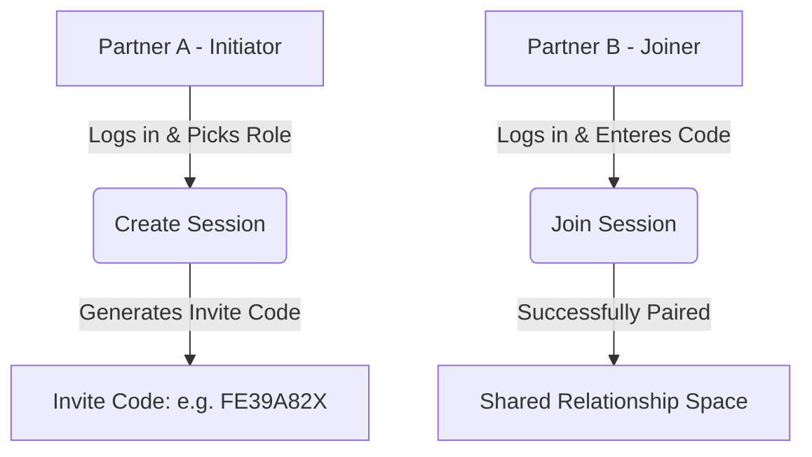

# BondXP — Usage & Deployment Guide

This guide explains how to test, use, and deploy **BondXP** live using Supabase, GitHub, and Vercel.

---

## 🛠️ 1. Local Development & Workflow

### Prerequisites
1. **Node.js**: Ensure Node.js (v18+) is installed.
2. **Supabase Project**: You need an active Supabase project.

### Quick Start
1. Install dependencies:
   ```bash
   npm install
   ```
2. Start the development server:
   ```bash
   npm run dev
   ```
   *Note: Next.js dev scripts run with `--webpack` to support the PWA plugin (`next-pwa` requires webpack compilation).*
3. Open `http://localhost:3000` in your browser.

---

## 👥 2. How the Dual-User (Giver / User) System Works

BondXP uses a **paired role system** mapped via invite codes.



### Roles
1. **Task User (Productivity Partner)**:
   * Logs completed tasks using presets or custom titles.
   * Secures a daily streak by completing 10 tasks before midnight.
   * Earns XP (banked available tasks).
   * Claims streak milestone rewards (Day 1, 3, 5, 7, 10, etc.) on qualification days.
   * Redeems store rewards, creating pending redemptions.
2. **Reward Giver (Affection Partner)**:
   * Reviews the pending redemptions queue to **Approve**, **Schedule**, or **Reject** (which refunds task XP back to the Task User).
   * Gifts bonus tasks (XP) to reward unexpected support or romance.
   * Manages the reward catalog (adds custom items, hides/shows categories).

### Local testing (User & Giver together)
To test both dashboards side-by-side on your local machine:
1. Open one standard browser window (e.g. Chrome) and log in. Pair/choose **Task User**.
2. Open an **Incognito window** or a different browser (e.g. Edge, Firefox) and log in with a different email. Enter the creator's invite code and select **Reward Giver**.
3. Now you can log tasks in Chrome, see the XP grow, request a redemption, and immediately approve/reject it in the Giver screen in Edge!

---

## ⚙️ 3. Managing Rewards (Adding, Reordering, Enable/Disable)

All reward management is controlled by the **Reward Giver** from the **Rewards** page (`/rewards` path):

1. **Adding a Reward**:
   * Click **Add Reward** at the top right.
   * Select a category, add a title, description, cost (in completed tasks), icon (emoji), and cooldown hours.
2. **Enabling / Deactivating**:
   * Click the **Toggle Switch** (toggle right icon) on any reward card.
   * Deactivated rewards display with a dotted border and are disabled in the Task User's store.
3. **Visibility Toggles (Hide / Show)**:
   * Click the **Eye / EyeOff** icon.
   * If hidden, the item is completely invisible in the Task User's store (perfect for planning surprise rewards!).
4. **Custom Reordering**:
   * Use the **Up and Down Arrows** on the right side of the card.
   * Reordering updates the `sort_order` in the database immediately, syncing the store view.
5. **Deleting**:
   * Click the red **Trash Can** icon to permanently delete the reward from the catalog.

---

## 🚀 4. Production Deployment: GitHub & Vercel

Since this repo will be hosted on GitHub, **never commit your `.env.local` file**. The `.gitignore` is already configured to exclude it.

### Step 1: Push Code to GitHub
1. Create a private repository on GitHub (private is recommended since relationship configurations can be intimate).
2. Push your local files to GitHub:
   ```bash
   git remote add origin https://github.com/your-username/bondxp.git
   git branch -M main
   git push -u origin main
   ```

### Step 2: Supabase Schema Deployment
Ensure you've run the SQL scripts in your Supabase SQL editor:
1. Run [schema.sql](file:///c:/Sagar/Projects/AntiGravityProjects/BondXP/supabase/schema.sql) first to set up the tables and RLS security.
2. Run [seed.sql](file:///c:/Sagar/Projects/AntiGravityProjects/BondXP/supabase/seed.sql) to add the initial catalog.

### Step 3: Deploy to Vercel
1. Log into your [Vercel Dashboard](https://vercel.com).
2. Click **Add New** -> **Project**.
3. Import your `BondXP` repository from GitHub.
4. Expand **Environment Variables** and copy the values from your local `.env.local` file:

| Vercel Key | Exact Source Location | Description / Format |
| :--- | :--- | :--- |
| `NEXT_PUBLIC_SUPABASE_URL` | **Supabase Dashboard** -> **Project Settings** -> **API** -> **Project URL** | The URL of your Supabase project (already in your local `.env.local` line 1). |
| `NEXT_PUBLIC_SUPABASE_ANON_KEY` | **Supabase Dashboard** -> **Project Settings** -> **API** -> **Project API Keys** (`anon public`) | The public key for client access (already in your local `.env.local` line 2). |
| `SUPABASE_SERVICE_ROLE_KEY` | **Supabase Dashboard** -> **Project Settings** -> **API** -> **Project API Keys** (`service_role secret`) | Secret administrative bypass key. |
| `NEXT_PUBLIC_VAPID_PUBLIC_KEY` | **Your local `.env.local` file** (Line 6) | Public VAPID key we generated for PWA push messaging. |
| `VAPID_PRIVATE_KEY` | **Your local `.env.local` file** (Line 7) | Secret VAPID key we generated for PWA push messaging. |
| `VAPID_EMAIL` | **Your custom value** | Formatted as `mailto:your-email@domain.com` (tells push servers who sent it). |
| `NEXT_PUBLIC_APP_URL` | **Vercel Deployment Dashboard** | The final live URL of your deployed Vercel app (e.g., `https://bondxp.vercel.app`). |

5. Click **Deploy**. Vercel will build the Next.js app and take it live!

---

## 🔔 5. Setting Up Push Notifications (NTFY)

To enable instant push notifications without dealing with browser service worker permissions:
1. Install the **NTFY App** on your phone ([Google Play](https://play.google.com/store/apps/details?id=io.heckel.ntfy) or [iOS App Store](https://apps.apple.com/us/app/ntfy-push-notifications/id1625396347)).
2. Go to **Settings** (`/settings`) on BondXP.
3. In the **Push Notifications (NTFY)** card, enter a unique, private topic name (e.g. `bondxp-ourspace-84931`). Click **Save**.
4. In the mobile NTFY app, tap **Subscribe to topic** and enter that exact topic name.
5. You'll now receive instant notifications on your phone whenever your partner logs a task, requests a wish, or claims a milestone!
